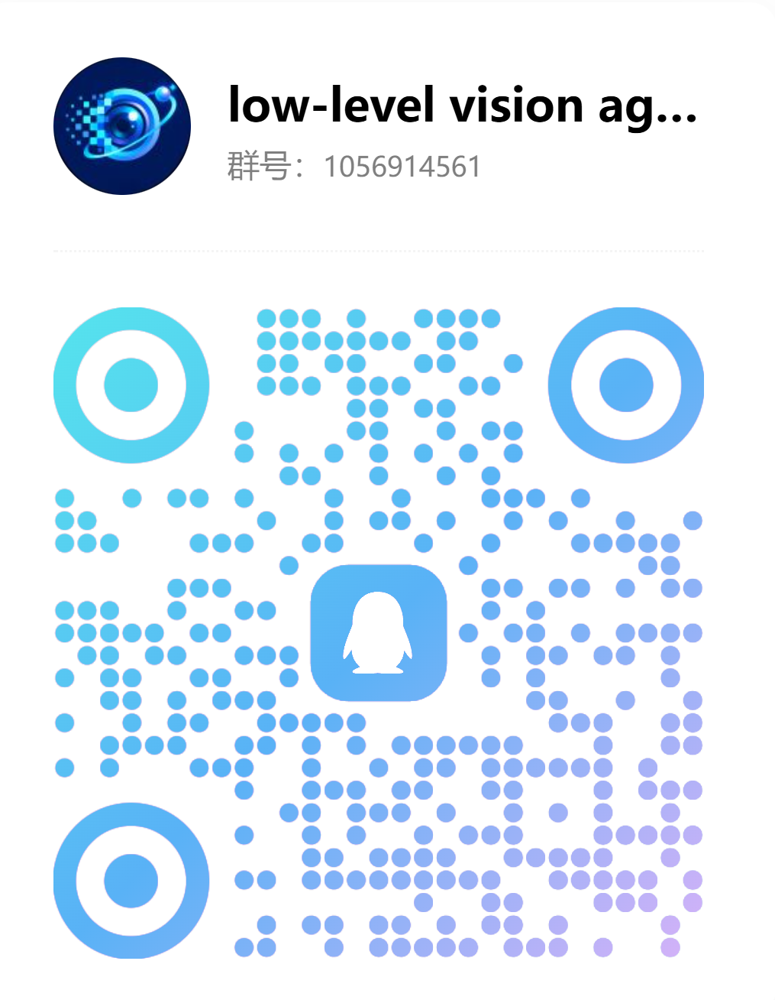

# Awesome Agent for Low-level Vision

A curated list of awesome papers, codes, and resources exploring the intersection of **Autonomous Agents / (M)LLM Agents** for **Low-level Vision** and some related works.

*This repository is maintained by [Lixin Wang]( 2059559391@qq.com) and [Jie Liu]( https://njulj.github.io/), feel free to contact us if you have any questions.*
## 💬 Community & Discussion

We welcome researchers, developers, and anyone interested in image restoration agents to join our community. Here you can:

- Discuss recent papers and research ideas
- Share open-source projects and useful resources
- Ask technical questions and exchange implementation experience
- Connect with others for potential research collaborations

Join our QQ group: **1056914561**

  
   
  Scan the QR code or search for the group number to join.

## 📑 Table of Contents
- [Awesome Agent for Low-level Vision](#awesome-agent-for-low-level-vision)
  - [📑 Table of Contents](#-table-of-contents)
  - [💡 Introduction](#-introduction)
  - [📝 Paper List](#-paper-list)
    - [Code Availability](#code-availability)
    - [Image Restoration](#image-restoration)
    - [Image Editing](#image-editing)
    - [Image Super-Resolution](#image-super-resolution)
    - [Video Restoration](#video-restoration)
    - [Computational Photography](#computational-photography)
    - [Image Retouching](#image-retouching)
    - [Image Quality Assessment (IQA)](#image-quality-assessment)
  - [🤝 Contributing](#-contributing)
  - [📄 License](#-license)

## 💡 Introduction
Image restoration and super-resolution have witnessed significant advancements with the introduction of generative models. Recently, the integration of **Autonomous Agents** and **Multi-Agent Systems (MAS)** has opened new paradigms for solving complex, real-world image degradation problems by leveraging planning, tool use, and interactive collaboration. This repository tracks the latest progress in this emerging field.

## 📝 Paper List

### Code Availability

- ✅ **Available**: Source code is publicly available.
- ⏳ **Pending**: The repository exists, but the implementation has not been released.
- ❌ **Unavailable**: The repository link is inaccessible or has been removed.

*Code availability last checked: September 9, 2026.*

### Image Restoration
|Year
|Pub
|Title
|Links
|Main Institution
|
|:---:|:----:|:----:|:----:|:----:|
|2026|ArXiV|**PaAgent**: Portrait-Aware Image Restoration Agent via Subjective-Objective Reinforcement Learning|\[[paper](https://arxiv.org/abs/2603.17055)\]\[[code pending ⏳](https://github.com/WYJGR/PaAgent)\]\[[project page](https://wyjgr.github.io/PaAgent.html)\]|NWPU|
|2026|CVPR|**Beyond Sequential Tools**: A Unified VLM Agent System for Photographic Post-Processing via Dynamic Multi-Expert Fusion|\[[paper](https://openaccess.thecvf.com/content/CVPR2026/html/Xiong_Beyond_Sequential_Tools_A_Unified_VLM_Agent_System_for_Photographic_CVPR_2026_paper.html)\]|ShanghaiTech|
|2026|IJCV|**Multi-Agent Image Restoration**|\[[paper](https://arxiv.org/pdf/2503.09403)\]\[[project page](https://villa.jianzhang.tech/publication/200604/)\]|PKU|
|2026|CVPRF|**Restore-R1**: Efficient Image Restoration Agents via Reinforcement Learning with Multimodal LLM Perceptual Feedback|\[[paper](https://openaccess.thecvf.com/content/CVPR2026F/papers/Lu_Restore-R1_Efficient_Image_Restoration_Agents_via_Reinforcement_Learning_with_Multimodal_CVPRF_2026_paper.pdf)\]\[[arXiv](https://arxiv.org/abs/2512.18599)\]|Amazon/NEU/UW-Madison|
|2026|ECCV|Self-Evolving Agentic Image Restoration via Deliberate Planning and Intuitive Execution|\[[paper](https://arxiv.org/abs/2606.28971)\]|ISCAS|
|2026|CVPR|**Hybrid Agents for Image Restoration**|\[[paper](https://arxiv.org/pdf/2503.10120)\]|USTC|
|2026|ArXiv|**Causal-AgentIR**: Self-Evolving Causal Memory for Adaptive Image Restoration Agents|\[[paper](https://arxiv.org/pdf/2607.21125)\]|SJTU|
|2026|ArXiv|**Derain-Agent**: A Plug-and-Play Agent Framework for Rainy Image Restoration|\[[paper](https://arxiv.org/pdf/2603.11866)\]|HIT|
|2026|ArXiv|**OPERA**: An Agent for Image Restoration with End-to-End Joint Planning-Execution Optimization|\[[paper](https://arxiv.org/pdf/2605.22104)\]\[[code ✅](https://github.com/xsyshuishui/Opera)\]|HIT|
|2026|ArXiv|**DiTTo**: Scalable Order-aware All-in-One Image Restoration Agent|\[[paper](https://arxiv.org/pdf/2605.30915v1)\]\[[code pending ⏳](https://github.com/CMLab-Korea/DiTTo-arxiv)\]\[[project page](https://cmlab-korea.github.io/DiTTo/)\]|Chung-Ang University|
|2026|ArXiv|**EvoIR-Agent**: Self-Evolving Image Restoration Agentic System via Experience-Driven Learning|\[[paper](https://arxiv.org/pdf/2605.22208)\]\[[code pending ⏳](https://github.com/rightleft-123/EvoIRAgent)\]|SYSU|
|2026|CVPR|**FAPE-IR**: Frequency-Aware Planning and Execution Framework for All-in-One Image Restoration|\[[paper](https://arxiv.org/abs/2511.14099)\]\[[code ✅](https://github.com/Programmergg/FAPE-IR/tree/main)\]|TJU|
|2026|CVPR|**EpiAgent**: An Agent-Centric System for Ancient Inscription Restoration|\[[paper](https://arxiv.org/pdf/2604.09367)\]\[[code pending ⏳](https://github.com/blackprotoss/EpiAgent)\]|SEU|
|2026|ArXiv|**TIR-AGENT:** Training an Explorative and Efficient Agent for Image Restoration|\[[paper](https://arxiv.org/pdf/2603.27742)\]|THU|
|2026|TIP|**IAMAgent:** Toward an Interactive and Adaptive Multi-Agent System for Image Restoration|\[[paper](https://ieeexplore.ieee.org/document/11433514)\]|HFUT|
|2026|Journal of Integration Technology|From specialized models to agentic systems: progress and challenges of agents in image restoration|\[[paper](https://jcjs.siat.ac.cn/article/doi/10.12146/j.issn.2095-3135.20251115001)\]|suat|
|2025|ICLR|**AgenticIR:** An Intelligent Agentic System for Complex Image Restoration Problems|\[[paper](https://arxiv.org/abs/2410.17809)\]\[[project page](https://kaiwen-zhu.github.io/research/agenticir)\]\[[code ✅](https://github.com/Kaiwen-Zhu/AgenticIR)\]|SJTU|
|2025|ArXiV|**Q-Agent**: Quality-Driven Chain-of-Thought Image Restoration Agent through Robust Multimodal Large Language Model|\[[paper](https://arxiv.org/abs/2504.07148))\]|SJTU|
|2025|ArXiV|**SimpleCall**: A Lightweight Image Restoration Agent in Label-Free Environments with MLLM Perceptual Feedback|\[[paper](https://arxiv.org/html/2512.18599v1))\]|Amazon|
|2025|CVPR|**JarvisIR**: Elevating Autonomous Driving Perception with Intelligent Image Restoration|\[[paper](https://arxiv.org/abs/2504.04158))\]\[[code ✅](https://github.com/LYL1015/JarvisIR)\]|XMU|
|2024|NIPS|**RestoreAgent:** Autonomous Image Restoration Agent via Multimodal Large Language Models|\[[paper](https://neurips.cc/virtual/2024/poster/93068#:~:text=RestoreAgent)\]\[[project page](https://haoyuchen.com/RestoreAgent)\]|HKUST(GZ)|
> **Note:** Institutions are abbreviated for table formatting (e.g., SJTU for Shanghai Jiao Tong University, PKU for Peking University).
### Image Editing
|Year
|Pub
|Title
|Links
|Main Institution
|
|:---:|:----:|:----:|:----:|:----:|
|2026|CVPRF|**MIRA**: Multimodal Iterative Reasoning Agent for Image Editing|\[[paper](https://openaccess.thecvf.com/content/CVPR2026F/html/Zeng_MIRA_Multimodal_Iterative_Reasoning_Agent_for_Image_Editing_CVPRF_2026_paper.html)\]\[[code pending ⏳](https://github.com/zzzmyyzeng/MIRA/tree/main)\]|Rochester|
|2026|ArXiv|**Agent Banana**: High-Fidelity Image Editing with Agentic Thinking and Tooling|\[[paper](https://arxiv.org/pdf/2602.09084)\]\[[project page](https://agent-banana.github.io/)\]\[[code pending ⏳](https://github.com/taco-group/agent-banana)\]|TAMU|
|2026|ArXiv|**PhotoAgent**: Agentic Photo Editing with Exploratory Visual Aesthetic Planning|\[[paper](https://arxiv.org/abs/2602.22809)\]\[[project page](https://mdyao.github.io/PhotoAgent/)\]\[[code pending ⏳](https://github.com/mdyao/PhotoAgent)\]|MMLab, CUHK|
|2026|ArXiv|**ImageEdit-R1**: Boosting Multi-Agent Image Editing via Reinforcement Learning|\[[paper](https://arxiv.org/abs/2603.08059v1)\]\[[code pending ⏳](https://github.com/zhaoyiran924/ImageEdit-R1)\]|NTU, Adobe|
|2026|ArXiv|**EditRefiner**: A Human-Aligned Agentic Framework for Image Editing Refinement|\[[paper](https://arxiv.org/abs/2605.07457v1)\]\[[code ✅](https://github.com/IntMeGroup/EditRefiner)\]|SJU, Vivo|
|2025|NeurIPS|**CREA**:A Collaborative Multi-Agent Framework for Creative Image Editing and Generation|\[[paper](https://arxiv.org/pdf/2504.05306)\]\[[project page](https://crea-diffusion.github.io/)\]|Virginia Tech|

### Image Super-Resolution
|Year
|Pub
|Title
|Links
|Main Institution
|
|:---:|:----:|:----:|:----:|:----:|
|2025|NIPS|**4KAgent**: Agentic Any Image to 4K Super-Resolution|\[[paper](https://arxiv.org/pdf/2507.07105)\]\[[project page](https://4kagent.github.io/)\]\[[code ✅](https://github.com/taco-group/4KAgent)\]|TAMU|

### Video Restoration
|Year
|Pub
|Title
|Links
|Main Institution
|
|:---:|:----:|:----:|:----:|:----:|
|2026|ArXiv|**VQ-Jarvis**: Retrieval-Augmented Video Restoration Agent with Sharp Vision and Fast Thought|\[[paper](https://arxiv.org/pdf/2603.22998)\]|PKU|
|2026|CVPR|Evolutionary Multi-Agent Collaboration for Real-World Video Face Restoration|\[[paper](https://openaccess.thecvf.com/content/CVPR2026F/papers/Tang_Evolutionary_Multi-Agent_Collaboration_for_Real-World_Video_Face_Restoration_CVPRF_2026_paper.pdf)\]\[[project page](https://bbuniverse.github.io/MA-VFR//)\]|HiT|
|2025|ArXiv|**MoA-VR**: A Mixture-of-Agents System Towards All-in-One Video Restoration|\[[paper](https://arxiv.org/abs/2510.08508)\]|SJTU|

### Computational Photography
|Year
|Pub
|Title
|Links
|Main Institution
|
|:---:|:----:|:----:|:----:|:----:|
|2026|ArXiv|**PhotoAgent**: A Robotic Photographer with Spatial and Aesthetic Understanding|\[[paper](https://arxiv.org/abs/2603.22796)\]|THU|
|2026|ArXiv|**HDRAgent**: An Agentic Framework for Multi-Exposure HDR Imaging|\[[paper](https://arxiv.org/abs/2606.09110)\]|NWPU|

### Image Retouching
|Year
|Pub
|Title
|Links
|Main Institution
|
|:---:|:----:|:----:|:----:|:----:|
|2026|AAAI|**PerTouch**: VLM-Driven Agent for Personalized and Semantic Image Retouching|\[[paper](https://arxiv.org/pdf/2511.12998)\]\[[project page](https://auroral703.github.io/PerTouch/)\]\[[code ✅](https://github.com/Auroral703/PerTouch)\]|NKU|
|2026|CVPRF|**IEA**: Amateur-Friendly Conversational Image Editing Agent via Three Stages of Multitask Alignment|\[[paper](https://arxiv.org/abs/2606.08016)\]\[[code ✅](https://github.com/OpenDFM/Image_Edit_Agent)\]|SJTU|
|2026|CVPR|**RetouchIQ**: MLLM Agents for Instruction-Based Image Retouching with Generalist Reward|\[[paper](https://openaccess.thecvf.com/content/CVPR2026/html/Wu_RetouchIQ_MLLM_Agents_for_Instruction-Based_Image_Retouching_with_Generalist_Reward_CVPR_2026_paper.html)\]|Adobe|
|2025|Arxiv|**Position**: Agentic Systems Constitute a Key Component of Next-Generation Intelligent Image Processing|\[[paper](https://arxiv.org/pdf/2505.16007v1)\]|INSAIT|

### Image Quality Assessment
|Year
|Pub
|Title
|Links
|Main Institution
|
|:---:|:----:|:----:|:----:|:----:|
|2026|ArXiv|**ME-IQA**: Memory-Enhanced Image Quality Assessment via Re-Ranking|\[[paper](https://arxiv.org/abs/2603.20785)\]|CityU|
|2026|ArXiv|**Q-Probe**: Scaling Image Quality Assessment to High Resolution via Context-Aware Agentic Probing|\[[paper](https://arxiv.org/abs/2601.15356)\]|USTC|
|2025|ArXiv|**AgenticIQA**: An Agentic Framework for Adaptive and Interpretable Image Quality Assessment|\[[paper](https://arxiv.org/abs/2509.26006)\]|NTU|
|2025|ACL|**CIGEval**: A Unified Agentic Framework for Evaluating Conditional Image Generation|\[[paper](https://arxiv.org/abs/2504.07046)\]\[[code ✅](https://github.com/HITsz-TMG/Agentic-CIGEval)\]|HITsz|
|2025|ACL|**Evaluation Agent**: Efficient and Promptable Evaluation Framework for Visual Generative Models|\[[paper](https://arxiv.org/abs/2412.09645)\]\[[code ✅](https://github.com/Vchitect/Evaluation-Agent)\]|Shanghai AI Lab|
|2025|ArXiv|**Q-Router**: Agentic Video Quality Assessment with Expert Model Routing and Artifact Localization|\[[paper](https://arxiv.org/abs/2510.08789)\]|TAMU|

## 🤝 Contributing
Welcome to contribute! If you find any awesome papers or projects that are not on the list, please feel free to open a Pull Request or Issue. 
1. Follow the exact format of the existing table entries.
2. Ensure the link to the paper is working.
3. If there is open-source code, please include the `[code]` link.

## 📄 License
This project is licensed under the [MIT License](LICENSE).
